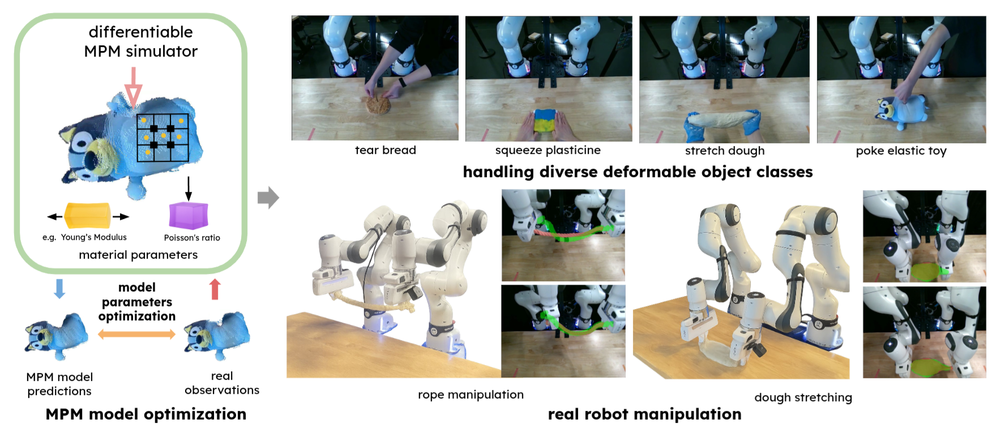

# EMPM: Embodied MPM for Modeling and Simulation of Deformable Objects

[Yunuo Chen*](https://yunuoch.github.io/), [Yafei Hu*](https://jeffreyyh.github.io/), [Lingfeng Sun](https://lingfeng.moe/), [Tushar Kusnur](https://ktushar14.github.io/), [Laura Herlant](https://www.linkedin.com/in/lauraherlant/), [Chenfanfu Jiang](https://www.math.ucla.edu/~cffjiang/)

*Equal contribution | Work done at Robotics and AI Institute

[paper](https://arxiv.org/abs/2511.13216) | [project site](https://embodied-mpm.github.io/)

### Overview
Embodied MPM (EMPM) is a deformable object modeling and simulation framework built on a
differentiable Material Point Method (MPM) simulator that captures the dynamics of challenging materials. From
multi-view RGB-D videos, our approach reconstructs geometry and appearance, then uses an MPM physics engine
to simulate object behavior by minimizing the mismatch between predicted and observed visual data.

<p align="center">
  
</p>

### Enviroment Setup
#### Linux Setup (CUDA 12.8 + Python 3.10 Specific)
```bash
# Create conda environment
conda create -y -n empm python=3.10
conda activate empm

# install cudatoolkit 12.8 inside the conda environment
conda install -c "nvidia/label/cuda-12.8.0" -c nvidia "cuda-toolkit=12.8"
export CUDA_HOME="$CONDA_PREFIX"          
export CUDACXX="$CUDA_HOME/bin/nvcc"
export PATH="$CUDA_HOME/bin:$PATH"
export CPATH="$CUDA_HOME/targets/x86_64-linux/include:${CPATH}"
export LD_LIBRARY_PATH="$CUDA_HOME/lib64:$CUDA_HOME/lib:$CUDA_HOME/targets/x86_64-linux/lib:${LD_LIBRARY_PATH}"
export LIBRARY_PATH="$CUDA_HOME/lib64:$CUDA_HOME/lib:$CUDA_HOME/targets/x86_64-linux/lib:${LIBRARY_PATH}"
export PYTHONNOUSERSITE=1

# run environment setup script
bash ./env_setup/env_setup.sh
```

### Data Processing
In `configs/experiments.yaml`, set `data_path` and list the experiments to run.
```bash
python3 scripts/data_process/process_data.py
python3 scripts/data_process/export_gaussian_data.py
python3 scripts/data_process/export_video_human_mask.py
```

### Training and Optimization
Physics simulation training:
```bash
# physics simulation training with cma-es (optional) and gradient-based optimization
python3 scripts/train_test/train_empm.py

# model rollout after params optimization
python3 scripts/train_test/test_empm.py
```

Gaussian splatting training and rendering:
```bash
# Train the Gaussian with the first-frame data
python3 scripts/gs/gs_train.py
python3 scripts/gs/gs_render.py
```

### Evaluations
```bash
# Use LBS to render the dynamic videos and export the evaluation data(The final videos in ./gaussian_output_dynamic folder)
python3 scripts/gs/gs_render_dynamics.py
# White bg renders → gaussian_output_dynamic_white/
python3 scripts/gs/gs_render_dynamics.py --white_background
python3 scripts/data_process/export_render_eval_data.py

# Get the quantative results
python3 scripts/eval/evaluate_chamfer.py
python3 scripts/eval/evaluate_track.py
python3 scripts/eval/evaluate_render.py

# Get the qualitative results
python3 scripts/viz/visualize_render_results.py
```

### Visualization on viser
```bash
python3 scripts/interactive_viser.py
```

## Maintenance

This repository is released as-is with no maintenance commitment or support
guarantee. Users should expect to diagnose issues themselves and fork the
repository for continued development or project-specific changes.

## License

Code authored by the Robotics and AI Institute is licensed under the [MIT License](LICENSE).
`third_party/gaussian_splatting/` and the Inria-derived files under `scripts/gs/`
are governed by the Inria Gaussian-Splatting License, which restricts use to
non-commercial research and evaluation. See [THIRD_PARTY_NOTICES.md](THIRD_PARTY_NOTICES.md)
for the applicable paths, license locations, and additional notices.

## Citation

If you find this work helpful, please kindly cite our paper

```bibtex
@article{chen_hu2026empm,
    title = {EMPM: Embodied MPM for Modeling and Simulation of Deformable Objects},
    author={Yunuo Chen* and Yafei Hu* and Lingfeng Sun and Tushar Kusnur and Laura Herlant and Chenfanfu Jiang},
    year={2026},
    booktitle={IEEE Robotics and Automation Letters (RA-L)}
}
```

## Acknowledgments

Parts of this codebase are adapted from [PhysTwin: Physics-Informed Reconstruction and Simulation of Deformable Objects from Videos](https://github.com/Jianghanxiao/PhysTwin). We thank the PhysTwin authors for releasing their code.
